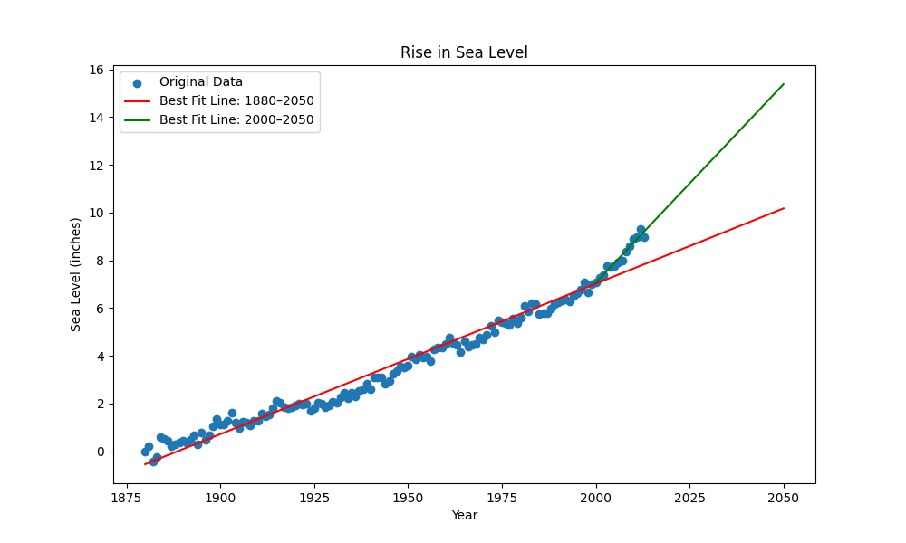

# Sea Level Predictor 

This project uses real-world data from the Environmental Protection Agency (EPA) to analyze and predict sea level rise. It is a part of the **Data Analysis with Python** certification from [freeCodeCamp](https://www.freecodecamp.org/).

##  Project Overview

The project performs the following tasks:
- Imports and analyzes data from `epa-sea-level.csv`.
- Creates a scatter plot to visualize historical sea level data.
- Fits a **linear regression line** to all available data and extends it to the year 2050.
- Fits another regression line using only data from **2000 to the most recent year**, and also extends it to 2050.
- Saves the final plot as an image file `sea_level_plot.png`.

##  Technologies Used

- Python 
- Pandas
- Matplotlib
- SciPy (for linear regression)

##  Files

- sea_level_predictor.py: Main script that reads the data and creates the plot.
- test_module.py: Unit tests to validate plot structure.
- epa-sea-level.csv: Dataset containing global sea level measurements.
- sea_level_plot.png: The output image of the plotted data.

##  Preview

##  Prediction

The regression analysis provides a prediction of sea level rise through 2050 based on:
1. Historical trends since 1880.
2. Accelerated trends observed since the year 2000.

##  How to Run Tests

You can run the test suite with
python test_module.py
